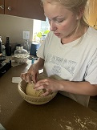
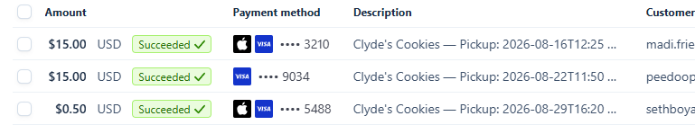

My fiance started a local cookie business and I had the idea to make her a website for it.

#

Clyde's Cookies is a full-stack web application that allows customers to browse products, build a shopping cart, schedule a pickup time, and securely pay online through Stripe.

I bought the domain then designed, developed, deployed, and debugged the application end-to-end, including the frontend, database, payment integration, serverless backend, and production deployment.

# Technology

**Frontend**
- React
- Vite
- JavaScript
- Tailwind CSS

**Backend & Database**
- Supabase
- PostgreSQL
- Supabase Edge Functions
- REST APIs

**Payments**

- Stripe Checkout
- Stripe Webhooks
- Stripe test and live environments

**Deployment**
- Vercel
- Supabase
- Custom domain / DNS

# Database design
The application uses relational tables for:

Products
Orders
Order items

Orders and order items are connected using foreign-key relationships. I have real orders that have been processed. 

# What I learned: 

This project gave me hands-on experience building and deploying a complete application rather than working only on isolated frontend or programming assignments.

It required connecting frontend code, backend services, databases, third-party APIs, payment processing, webhooks, and production infrastructure into one system.
